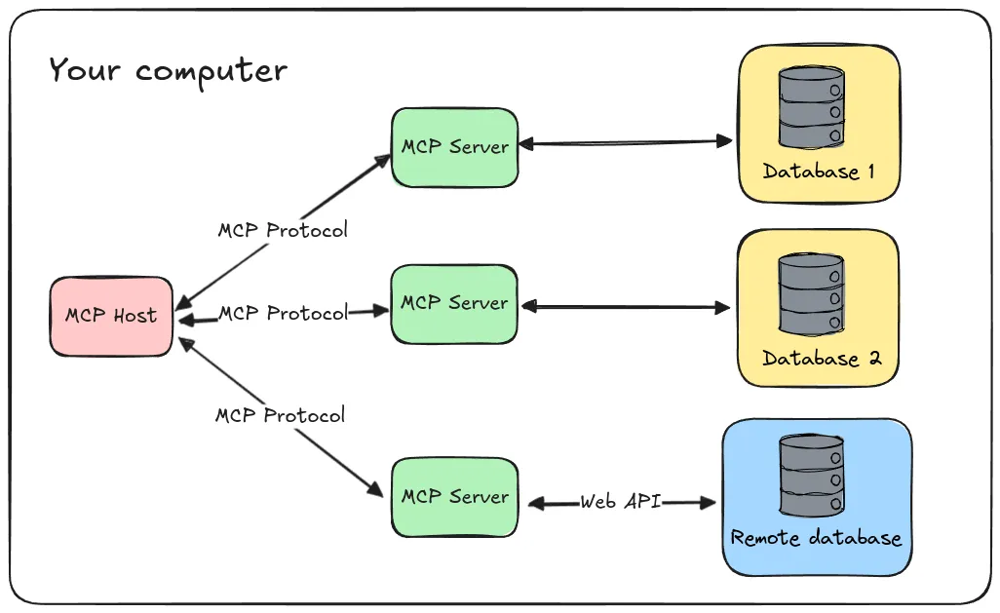
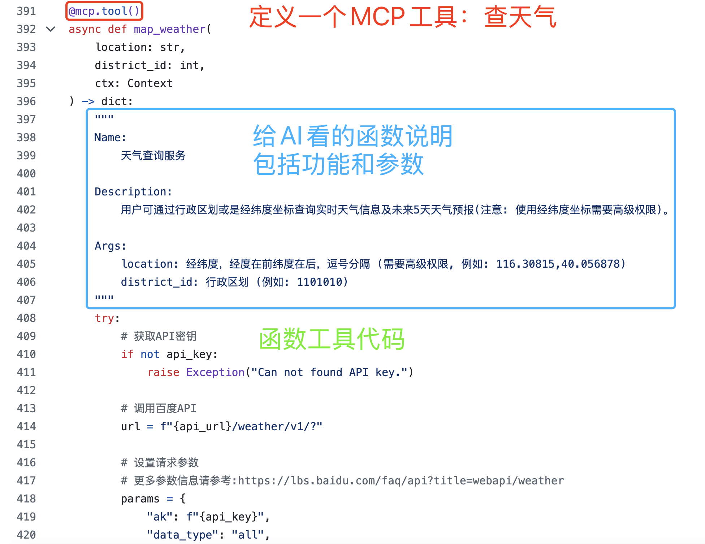

# Dify MCP综合应用
---
🧑‍🔧作者：王熠明
🔗链接：[Dify MCP综合应用 - 飞书云文档](https://spvrm23ffj.feishu.cn/docx/Nmbjde0GtoLMvBxuy4hc3YHTnVc)
学习时间：2025/10/4
简介：讲述Model Context Protocol（MCP）所解决掉的Function calling的局限性，

## MCP介绍
---
把Agent比喻成人类的话，LLM相当于人类的大脑与主观意识驱动，没有手脚与工具，仅能实现对话交互；Tools相当于Agent的手脚与工具，而MCP则是打包好的工具（未来：有维护、有管理、有迭代的）。

>原文还讲述了工具实现逻辑，此处跳过

**客服对话流程示例**
假设用户提问：“Hi, can you tell me the delivery date for my order?”
助手应执行以下步骤：
1. 识别意图：用户明确要求“delivery date”，符合工具调用条件。
2. 参数提取：需引导用户提供 `order_id`（因消息中未直接包含该信息）：
_“Sure! Please provide your order ID so I can check the delivery schedule.”_
3. 工具调用：获得 `order_id` 后，后台执行 `get_delivery_date(order_id="XXX")`。
4. 返回结果：向用户展示函数返回的配送日期（如 _“您的订单预计在2025年6月25日18:00前送达”_）。

**提示词书写Function Call的局限性**
- 写一大段复杂提示词，需要语文功底
- 相同的函数和工具，开发很多次重复书写相同内容（模型回复格式撰写、调试提示词）
- 不同软件厂商的API接口使用方式也不统一
- 没有统一市场和生态，各自开发模型为战
- 厂商的智能体大模型编排能力参差不齐，标准不一致

**MCP协议作用**
一种连接【大模型（客户端）】和【各种工具应用（服务端）】的统一接口
解决“统一大模型调用工具的方法”问题

**MCP的应用案例**
- 调用Unity的MCP接口，让AI自己开发游戏。 https://www.bilibili.com/video/BV1kzoWYXECJ
- 调用Blender的MCP接口，让AI自己3D建模。 https://www.bilibili.com/video/BV1pHQNYREAX
- 调用百度地图的MCP接口，让AI自己联网，查路况，导航。 https://www.bilibili.com/video/BV1dbdxY5EUP
- 调用Playwright的MCP接口，让AI自己操作网页。

**MCP协议的通信双方**
- **MCP Host**：人类电脑上安装的客户端软件，一般是Dify、Cursor、Claude Desktop、Cherry Studio、Cline，软件里带了大语言模型，后面的教程会带你安装配置。
- **MCP Server**：各种软件和工具的MCP接口，比如： 百度地图、高德地图、游戏开发软件Unity、三维建模软件Blender、浏览器爬虫软件Playwrights、聊天软件Slack。尽管不同软件有不同的功能，但都是以MCP规范写成的server文件，大模型一眼就知道有哪些工具，每个工具是什么含义。

**MCP的Host、Client、Server是什么关系**
Host就是Dify、Cursor、Cline、CherryStudio等MCP客户端软件。
每个MCP服务需要对应Host中的一个Client来一对一通信。Client被包含在Host中。

Client是Host与Server的桥梁，负责实现具体服务

**大模型感知工具调用及其作用**
每个支持MCP的软件，都有一个MCP Server文件，里面列出了所有支持调用的函数，函数注释里的内容是给AI看的，告诉AI这个函数是做什么用的。
MCP Server文件就是给AI看的工具说明书。

例如百度地图MCP案例：
https://github.com/baidu-maps/mcp/blob/main/src/baidu-map/python/src/mcp_server_baidu_maps/map.py
每个以`@mcp.tool()`开头的函数，都是一个百度地图支持MCP调用的功能。

Dify关于MCP介绍：[mp.weixin.qq.com/s/CDhqmLO1JXSB\_\_aUMqoGoQ](https://mp.weixin.qq.com/s/CDhqmLO1JXSB__aUMqoGoQ)
## Dify的MCP插件
---
- Dify平台的模型和工具以插件形式独立运行
- 热插拔设计插件

Dify插件帮助文档>>[功能简介 - Dify Docs](https://docs.dify.ai/zh-hans/plugins/introduction)

MCP插件来源：
- Dify Marketplace
- 社区共享：GitHub
- 本地私域

## MCP国内平台及应用服务
---

## 搭建一个MCP智能体
---

## MCP工作流实践
---

## 工作流转换MCP介绍
---
