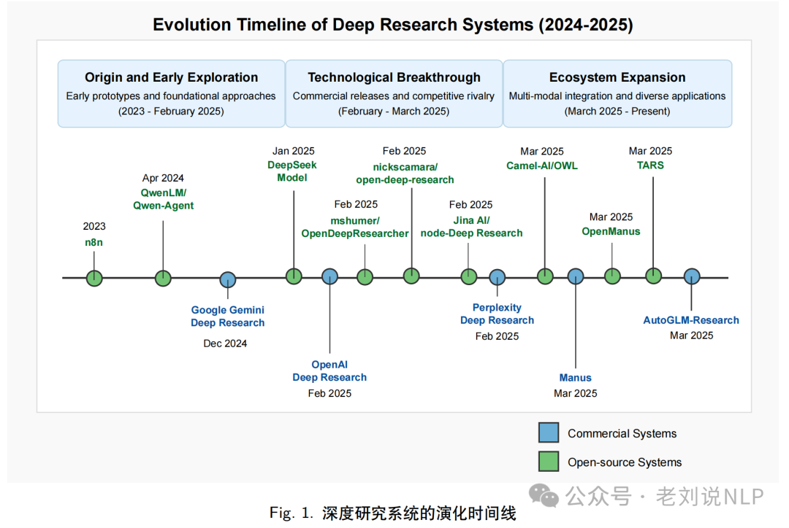
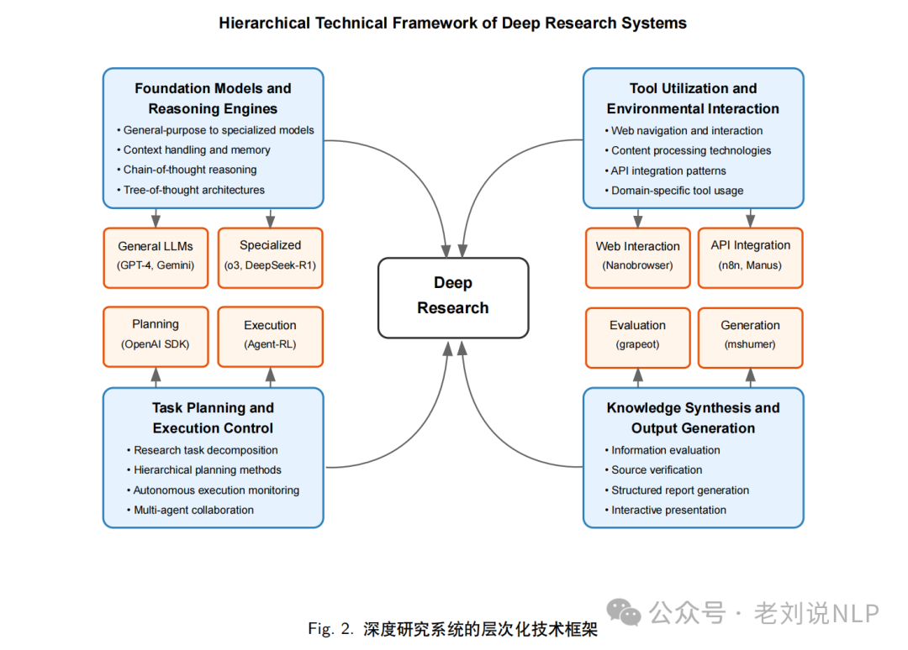
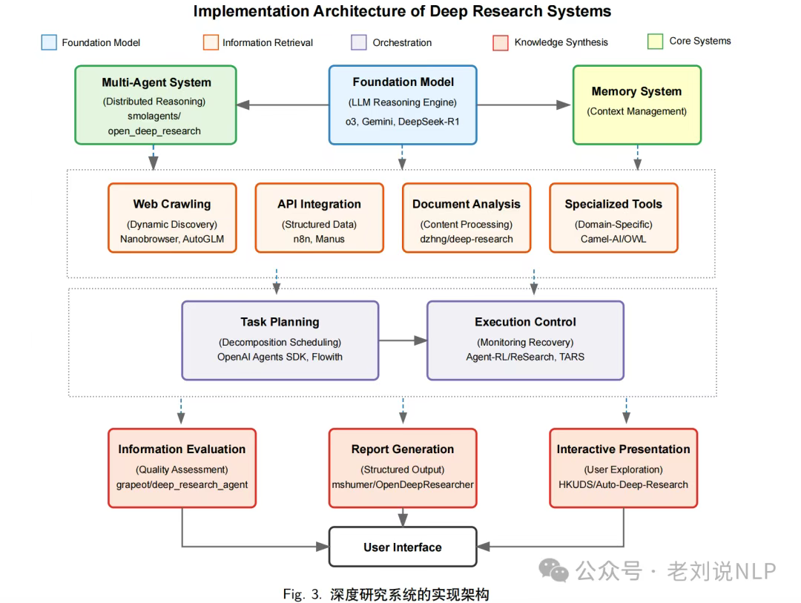
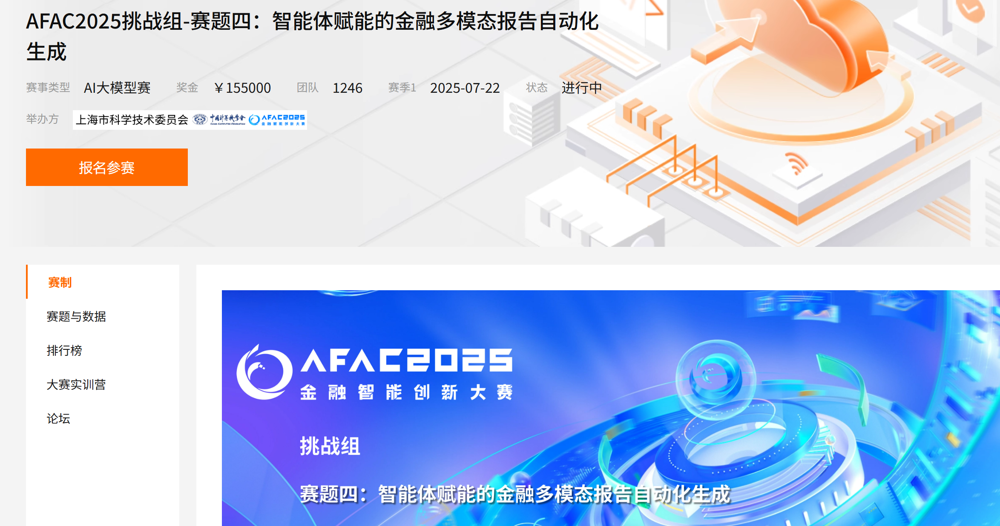
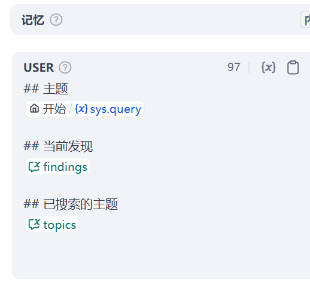

# DeepResearch_Dify
---
🧑‍🔧作者：王熠明
🔗链接：[deepresearch 设计 - 飞书云文档](https://spvrm23ffj.feishu.cn/wiki/HKlBw23R4iZaBnkcLlHcnPjPneh?from=from_copylink)
学习时间：2025/10/4
简介：
包含讲解Deepresearch的发展、结构拆解、Deepresearch的实现。
该项目快速了解Deepresearch的发展与如何使用Dify实现DeepResearch。

## DeepResearch的综述
---
发布于OpenAi的2025年2月2日，对话驱动AI进行多步骤交互研究
参考开源项目：
- 谷歌：[GitHub - google-gemini/gemini-fullstack-langgraph-quickstart: Get started with building Fullstack Agents using Gemini 2.5 and LangGraph](https://github.com/google-gemini/gemini-fullstack-langgraph-quickstart)
- 其他项目：[GitHub - dzhng/deep-research: An AI-powered research assistant that performs iterative, deep research on any topic by combining search engines, web scraping, and large language models. The goal of this repo is to provide the simplest implementation of a deep research agent - e.g. an agent that can refine its research direction overtime and deep dive into a topic.](https://github.com/dzhng/deep-research)

文献综述：《**A Comprehensive Survey of Deep Research: Systems, Methodologies, and Applications**》
🔗链接： https://arxiv.org/pdf/2506.12594
分析了2023年的DeepResearch的案例

**Deepresearch框架索引**
[GitHub - scienceaix/deepresearch: Awesome Deep Research list! For more details, please refer to our survey paper -- A Comprehensive Survey of Deep Research: Systems, Methodologies, and Applications](https://github.com/scienceaix/deepresearch)

**DeepResearch发展三个阶段**


**Deepresearch的层次化技术框架**
包括基座与推理模型、任务规划与执行、工具使用与环境交互、知识生成。


**Deepresearch的实现架构**
包括四种基础架构模式：单体式、基于流水线的、多智能体以及混合实现。

框架对比、技术存在问题、值得研究的几个方向详见论文原文


## DeepResearch的发展
---
**解决的痛点：**
- 搜索引擎的缺点是整理的内容过于碎片化，对问题不会理解导致获取的内容和问题不匹配。
- 大模型的缺点是由于训练导致的存量语料数据永远与真实资料有时间差，而且因为大语言模型是概率模型导致在回答问题时会有幻觉。
三个DR产品发展方向：
- 交互体验优化
- DeepResearch更加Deep
- 垂类深度检索


## Dify实现DeepResearch
---
### 结构拆解

### 工作准备
- 直接引入基础工作流（Dify的DeepResearch案例）
- 安装插件
- 会话变量配置，储存LLM对话变量
- 代码执行模块：
	- 查询最大次数
	- 返回数组类型（循环次数和深度） #Question 
- 迭代模块：输入数组、输出字符串
- Tavily Search插件/Bocha/DuckDuckGo
  使用Github登陆
- JSON解析：获取大模型返回的JSON数据后进行提取
	- 用于提取子查询和是否继续两次使用

### 理顺DeepResearch流程
输入：
- 对话内容、Deep次数
- 配置迭代次数
LLM模型配置：
- 使用deepseek V3
- 设置sys prompt：定义身份、做什么、定义输出、输出子查询任务、以及是否距虚查询、明确定义输出JSON格式（用于JSON提取器使用）。
- 由于4o针对json 抽取有特定的训练，当使用deepseek等模型时一般为了遵循md格式，会输``` JSON ``` 这样的内容，我们在llm后额外加一个代码执行模块处理一下就能解决
```python
def main(arg1: str) -> dict:
    if('```json' in arg1):
        arg1 = arg1.replace('```json','')
    if('```' in arg1):
        arg1 = arg1.replace('```','')
    return {
        "result": arg1,
    }
```
- 配置代码执行的JSON结果给到两个JSON提取节点上
LLM得到的子查询任务与是否继续查询加载到会话变量：将子查询任务增加到查询主题中 #Question 不理解为什么要做这个变量赋值
IF判断是否进行查询
- Tavily
- 空白输出节点对齐
- 中间输出格式：用于展示循环状态，比如第一轮是：1/3轮完成DeepResearch任务。
- 变量聚合
拓展：
- 循环内的大模型模块，解读一下USER提示词的内容
- 了解到查询的主题，目前查询的结果。然后已经查询的内容。已经串好变成输入。
- 这样大模型也有了刚才工作的记忆。
- 
循环结束，使用大模型做结果整合
- 编写sys prompt和use prompt

### 实操结果


### 深入设计
更难的Deep Research工作流应用
`Research agent process flow`
可以实现循环过程中外层反思循环，内层执行循环，智能体在执行循环中针对特定子主题展开研究工作。

这个过程与人类研究中的 “反思” 阶段非常相似 —— 思考 “我已经知道什么”、“我还需要知道什么” 以及 “我接下来应该查询什么”。整个系统的创新之处就在于这种迭代方法：收集信息；分析现有信息与原始问题之间的 “差距”；生成新的查询以填补这些差距；重复这个过程，直到差距被填补。

## 拓展
---
需要学会写JSON
深度理解Tavily怎么配置
去学习`Research agent process flow`使用，如何使用MCP浏览器检索