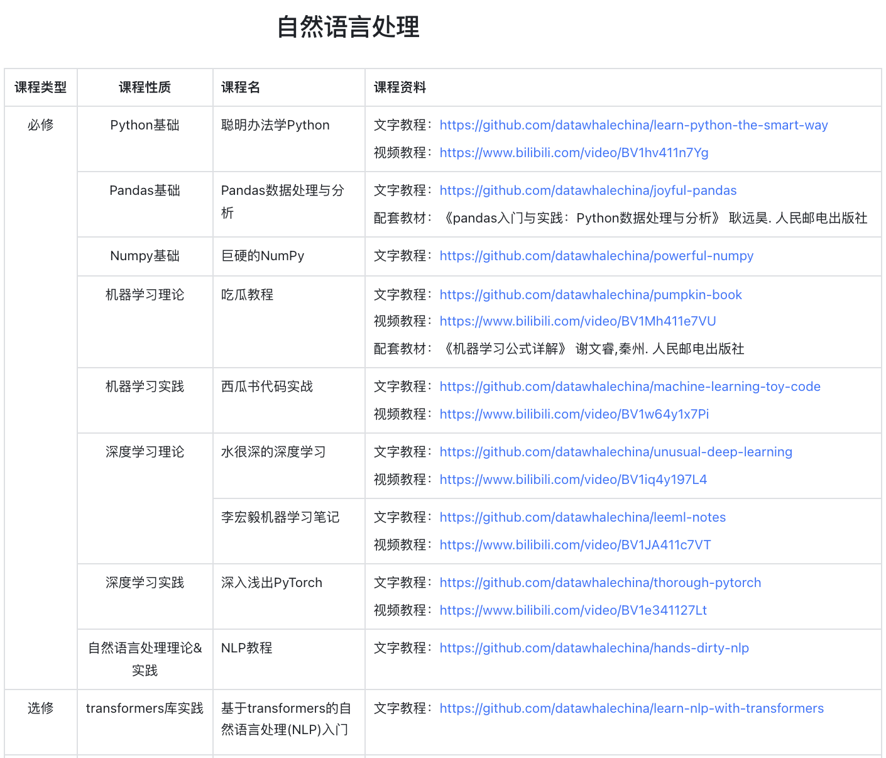
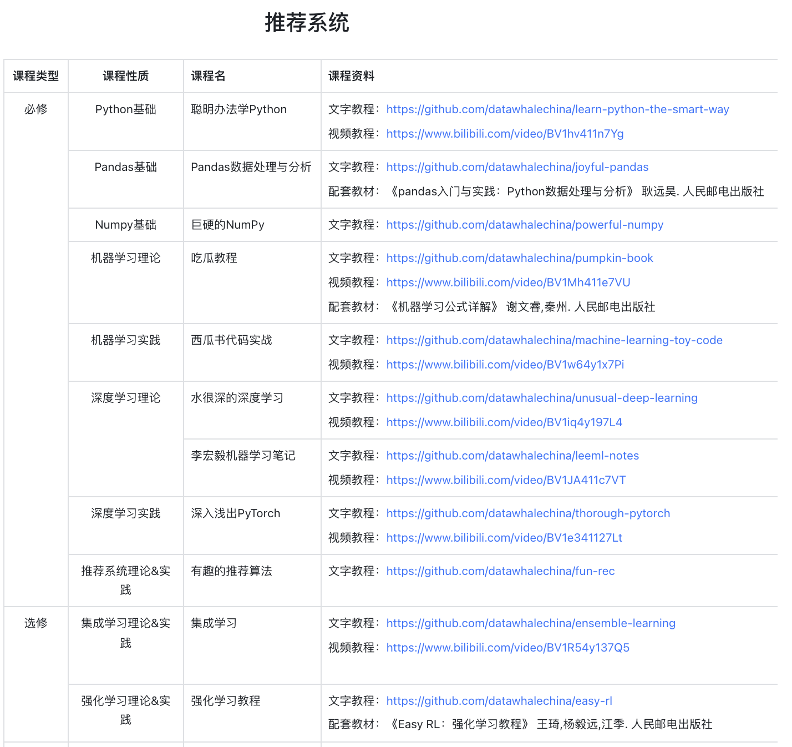
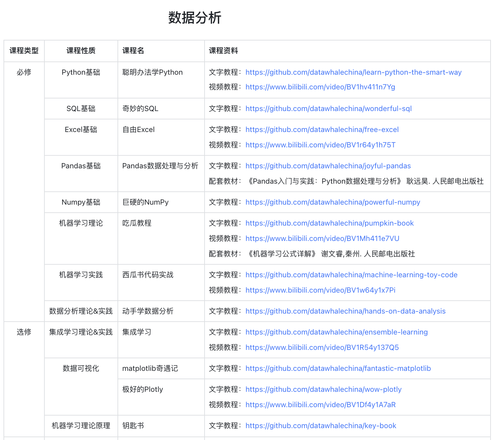
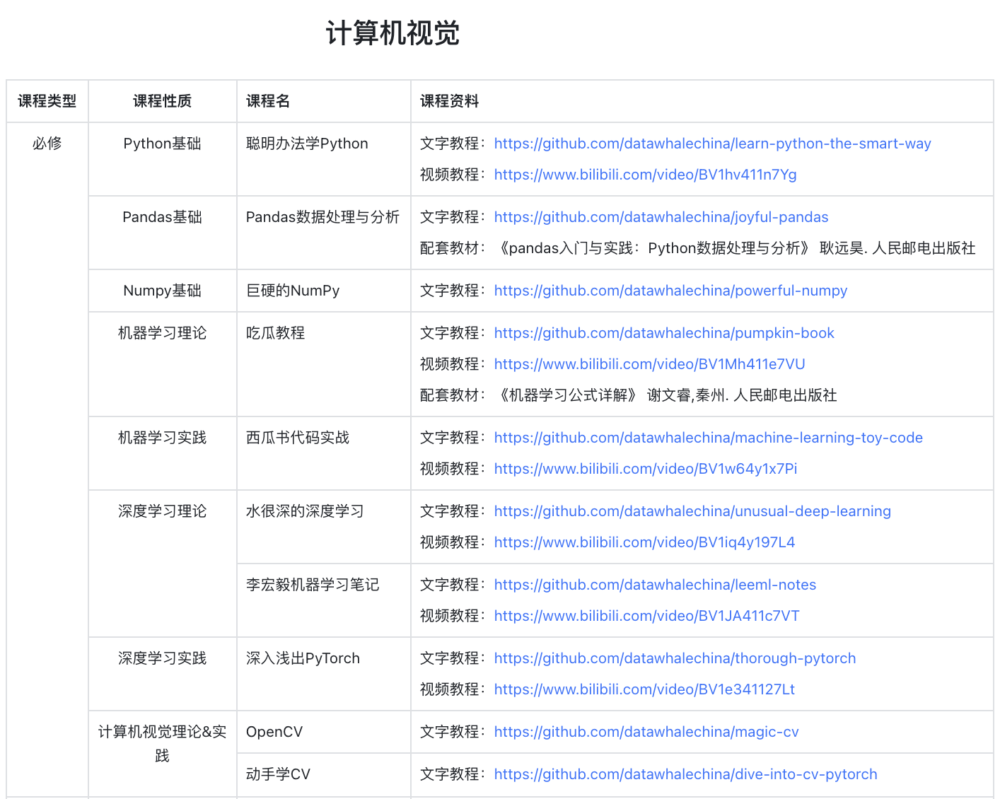

# 2025近期的课程体系
## 共学教程：RAG技术全栈指南
**课程简介**
本项目是一个面向大模型应用开发者的RAG（检索增强生成）技术全栈教程，旨在通过体系化的学习路径和动手实践项目，帮助开发者掌握基于大语言模型的RAG应用开发技能，构建生产级的智能问答和知识检索系统
适合人群：具备Python编程基础，对RAG技术感兴趣的开发者，希望系统学习RAG技术的AI工程师，想要构建智能问答系统的产品开发者，对检索增强生成技术有学习需求的研究人员
学习名额：180人
[Fetching Title#ghch](https://github.com/datawhalechina/all-in-rag)

## 共学教程：工作流自动化平台n8n入门教程
**课程简介**
在自动化工作流日益重要的当下，n8n凭借其强大的集成能力和灵活的配置方式，成为众多开发者和企业的 首选工具。本课程以 “理论 + 实操” 为核心，通过系统的内容编排，带你从入门到精通n8n，解锁自动化 工作流的无限可能
适合人群：希望提升工作效率，实现业务流程自动化的职场人士，对自动化工作流、低代码开发感兴趣的开发者，计划使用n8n搭建复杂集成系统的技术团队成员
学习名额：180人
[GitHub - datawhalechina/handy-n8n: handy-n8n, learn n8n by doing](https://github.com/datawhalechina/handy-n8n)

## 共学教程：Github最火大模型原理与实践教程
**课程简介**
Happy-LLM是一个**系统性的 LLM 学习教程**，将从 NLP 的基本研究方法出发，根据 LLM 的思路及原理逐层深入，依次为读者剖析 LLM 的架构基础和训练过程。同时，结合目前 LLM 领域最主流的代码框架，演练如何亲手搭建、训练一个 LLM，期以实现授之以鱼，更授之以渔。【注：本期课程将学习教程的1～3章，以理论基础为主】
适合人群：有基本的深度学习基础，想要系统上手 LLM 理论知识的学习者
学习名额：180人
[GitHub - datawhalechina/happy-llm: 📚 从零开始的大语言模型原理与实践教程](https://github.com/datawhalechina/happy-llm)

## 从零手搓大模型
**课程简介**
手搓LLM、GraphRAG架构，深度了解LLM模型(以Qwen2为例)，手撕大模型GraphRAG系统架构
**适合人群：具有深度学习基础，能够初步完成LLM微调或部署者，食用本教程效果更佳**
**学习名额：180人**
[GitHub - datawhalechina/tiny-universe: 《大模型白盒子构建指南》：一个全手搓的Tiny-Universe](https://github.com/datawhalechina/tiny-universe)

## 从零开始构建多智能体系统
**课程简介**
本教程基于国内领先的多智能体框架 CAMEL-AI（NeruIPS'2023），从最基本的单个 Agent 开发，逐渐尝试构建复杂的 Multi Agent 应用。通过这个项目，我们希望帮助开发者掌握 CAMEL 框架的使用方法，理解 Agent 的基本概念，为后续的学习使用打下坚实的基础，逐步提高开发者在构建和管理智能体方面的技能
适合人群：拥有**LLM基础、能尝试阅读和理解项目源代码和理论****，****想要更近一步的学习者**
学习名额：180人
[GitHub - datawhalechina/handy-multi-agent: This is a multi agent tutorial based on the CAMEL framework, aimed at understanding how to build an Agent Society from the ground up!](https://github.com/datawhalechina/handy-multi-agent)

## **商汤小浣熊：动手学AI+数据分析**
**课程简介**
学习了解AI+数据分析的定义和应用场景，通过AI+数据分析动手实践项目，提高数据分析和使用AI的能力，完成学习后，还可进行AI+数据分析能力认证。
学习名额：180人
**在线学习网站**
https://www.datawhale.cn/learn/summary/65

# Datawhale人工智能培养方案
---
## 自然语言处理

## 推荐系统

## 数据分析

## 计算机视觉CV
