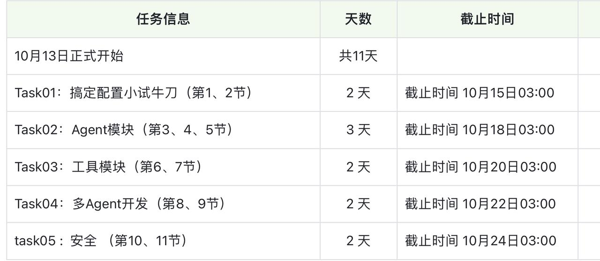

🔗学习链接：[wow-agent/tutorial/第03章-openai-agents at main · datawhalechina/wow-agent · GitHub](https://github.com/datawhalechina/wow-agent/tree/main/tutorial/第03章-openai-agents)
📒笔记：格式为`.ipynb`，请使用IDE查看。
Task规划：

