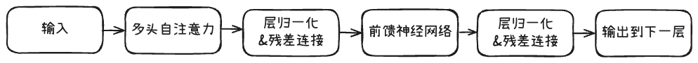
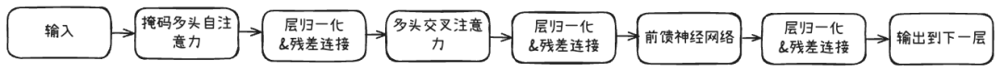

# 第二章 Transformer架构
---

## 一、注意力机制
---

### 1. 什么是注意力机制
Word2Vec单层神经网络-->神经网络
计算机视觉（Computer Vision）CV发展起源**神经网络核心三种架构：**
- 全连接神经网络（Feedforward Neural Network，FNN）
- 卷积神经网络（Convolutional Neural Network，CNN）
- 循环神经网络（Recurrent Neural Network，RNN），能够使用历史信息作为输入、包含环和自重复的网络：

**RNN及LSTM具有捕捉时序信息，但是存在两个缺陷**：
- 长记忆丢失：序列按顺序读入，距离变长、内存有限
- 串行计算，效率低下：无法很好利用GPU

利用了CV的注意力机制（Attention），在NLP领域做出了基于注意力机制的神经网络--Transformer，成为LLM、深度学习最核心的架构之一。

**注意力机制（Attention）：**
大脑🧠未来理解当前目标，对所有输入信息进行扫描，分配不同注意力分数的能力，就是**注意力机制。**

**简化的工作流程（Q，K，V模型）**
Query，Key，Value

Query：查询目标
Key：vector（““电脑”的索引/或者概括”），索引标签。**计算相关性，吸引注意力，与Q计算“注意力分数”。** 
Value：vector（“电脑”），内容本身。**被提取使用，提供内容，与“注意力分数”就行加权求和得出结果。** 

真值（Ground Truth）：模型训练的目标答案

在**训练**一个翻译模型时，模型内部的**注意力机制**会利用 **Key** 和 **Value** 去处理输入的句子，得出一个翻译结果（预测）。然后，模型会把这个结果和数据集里的**真值（Ground Truth）进行比较。如果发现有差距，模型就会调整自己内部的所有参数，包括那些用来生成  Key** 和 **Value** 的网络层，以便下次能做出更接近**真值**的预测。

### 2. 深入理解注意力机制
如何计算得处注意力分数？

 **Step1:测量相似度，计算单个词Score**
词向量表示语义信息，距离远近表示词义接近。通过欧式距离来衡量词向量的相似性，此处使用点积计算。
$$
v·w = \sum_{i}v_iw_i
$$
语义相似：点积>0，语义不相似：点积<0。

**Step2:计算一系列的原始Score**
计算Query与所有词的Key向量进行矩阵点积计算，得到x为Q与所有词Key（包含自己）的相关性。此处是一一对应，而非求和结果。
$$
x = qK^T
$$
```
**举例：** 假设我们要理解句子 "The cat sat" 中 "cat" 这个词。
Q_cat 会分别和 K_The、K_cat、K_sat 进行点积。
得到三个原始分数：
e1 = Q_cat \cdot K_The (比如得到 12.5)  
e2 = Q_cat \cdot K_cat (比如得到 30.8)
e3 = Q_cat \cdot K_sat (比如得到 25.1)

这些分数 `[12.5, 30.8, 25.1]` 直观地反映了相关性，分数越高，相关性越强。
```

**Step3:稳定训练技巧——缩放**
原因：所有向量的d维度很高，点积计算结果会特别大，导致过大树枝对于后续的（Softmax）带来困难，导致梯度（模型学习修正信号）变得极小，不利于模型训练
解决方案：增加缩放因子
$$ \sqrt{d_k} = \sqrt{64} = 8 $$
dk为k的维度
把上一部计算的e1、e2、e3进行scaled。
```
e1_scaled = 12.5 / 8 = 1.56
e2_scaled = 30.8 / 8 = 3.85
e3_scaled = 25.1 / 8 = 3.14
```
为了利于模型稳定学习

**Step4:转换为最终权重--Softmax函数/归一化处理**
最终结果目的是“注意力权重”，必须满足**正数**和**所有权加起来为1**。百分比计算使用。
此处使用了自然常数e的指数函数去解决这两个问题。
$$ \text{softmax}(x)_i = \frac{e^{xi}}{\sum_{j}e^{x_j}} $$
**Step5:最终的attention公式**
$$
attention(Q,K,V) = softmax(\frac{QK^T}{√d_k})v
$$

### 3. 注意力机制的实现
```python
'''注意力计算函数'''
def attention(query, key, value, dropout=None):
    '''
    args:
    query: 查询值矩阵
    key: 键值矩阵
    value: 真值矩阵
    '''
    # 获取键向量的维度，键向量的维度和值向量的维度相同
    d_k = query.size(-1) 
    # 计算Q与K的内积并除以根号dk
    # transpose——相当于转置
    scores = torch.matmul(query, key.transpose(-2, -1)) / math.sqrt(d_k)
    # Softmax
    p_attn = scores.softmax(dim=-1)
    if dropout is not None:
        p_attn = dropout(p_attn)
        # 采样
     # 根据计算结果对value进行加权求和
    return torch.matmul(p_attn, value), p_attn

```
其中，dropout是做了p_attn的矩阵权重暂时归零，防止”过拟合“（Overfitting）和保证好的鲁棒性

return：结果、矩阵
结果中的“目标词”不仅仅存在value结果，还存在一个包含了上下文学习的（矩阵信息）。

### 4. 自注意力
Self-Attention

注意力完全发生在输入的序列内部，一个词在自己句子内部的注意力。而不是输入一个Q，在另外提供的KV中计算注意力。

Self-Attention会定义每个词的权重矩阵（Weight Matrix）；
$$
W^Q,W^K,W^V
$$
这三者会各自负责把词向量x转化为适配自己对应Query，Key，Value的向量。由一个输入，得出QKV。

作用：
- 真正的上下文感知：句子中任意两个词可以直接计算关系，不受距离限制，解决了LSTM的问题。
- 高并行运算：能够同时让所有词进行注意力计算，而不是仅计算一个词
- Transformer基石：由多个Self-Attention+前反馈网络组成

意义：Attention是基于LSTM串行架构为核心+注意力模块为辅助的上下文理解；Self-Attention是注意力模块为核心构建的上下文理解。

>计算机对一个句子的阅读能力
>**Word2Vec**
> 静态翻译，一个词一个向量值，无法理解上下文解决多义词问题
>**ELMo**
>实现句子内部感知上下文，通过上下文去生成向量，**动态向量**。局限性是超长LSTM理解
>**Attention**
>Encoder-Decoder 架构
>翻译工作，目标词去聚焦源头的那一块内容实现翻译
>**Self-Attention**
>不使用LSTM架构，该用并行架构。

### 5. 掩码自注意力
Mask Self-Attention

**掩码作用**：遮蔽掉一些特定位置的token，模型在学习过程中，会忽略掉遮蔽的token。核心在于不让模型看到未来信息。只能通过之前的token去预测下一个token。

**掩码注意力机制的实现：**
计算完QK^T 后，送入Softmax之前会得到“原始注意力分数”矩阵`Scores。`

```
我 爱 你 (Key) 
我 [10, 8, 5] 
爱 [ 9, 12, 11] 
你 [ 4, 7, 9] 
(Query)
```

生成一个掩码矩阵`mask`
```
我 爱 你 
我 [ 0, -∞, -∞] 
爱 [ 0, 0, -∞] 
你 [ 0, 0, 0]
```

实现方式：送入Softmax之前进行分数矩与掩码矩阵相加。
`Scores_masked=Scores+mask`

最后通过Softmax，把`-∞`处理为0则得到了：
```
我 爱 你 我 [1.0, 0.0, 0.0] // “我”只能100%关注自己 
爱 [0.2, 0.8, 0.0] // “爱”的注意力分配给了“我”和“爱” 
你 [0.1, 0.4, 0.5] // “你”的注意力分配给了所有人
```

**该方法应用于Decoder部分，其关键在于实现并行计算序列预测任务**

### 6. 多头注意力
Multi-Head Attention

之前的的自注意力缩放点积、QK^T、Mask、Score的完整流程属于单头注意力，而多头注意力可以理解为“团队协作”机制。

自注意力机制解决了并行问题，但是其中还存在单头只能拟合**一种相关关系**。（如语法一类，无法拟合其他关系）这块理解为进行**自注意力点积**的时候，只能**允许一种关系的自注意力点积**。


>图源：论文：Attention Is All Need
>图中两层为两个注意力头对同一段语句序列进行自注意力计算的结果。可以看到，对于不同的注意力头，能够拟合不同层次的相关信息。

“假设模型维度的`d_model=512`，头数为`h=8`，准备8组独立的W^qW^kW^v，输入词向量X分别乘以这8组举证，得到矩阵后，每一组降维为64。

**模型维度**：`d_model`由人工确定，根据性能与成本去衡量。
在Input Embedding中，一个单词（Token）输入后会转化为一个向量，其长度（维度）即为`d_model`。

代码如下：
```python
import torch.nn as nn
import torch

'''
该项目先采用了PyTorch的nn.Module去改造。
准备工作：__init__函数（构造函数）构建方法，只运行一次
工作阶段：forward函数 定义数据流过运行，多次调用

super().__init__()调用父类nn.Module的方法
后续会调用其中的数据类型作为使用

args.dim 模型的总维度
args.n_heads 模型的头数
self.head_dim 每个头的维度
args.n_embd ？

nn.Linear()PyTorch创建全连接层命令，即权重矩Wqkv,Wo用于容纳所有头的结果
nn.Linear(input_tensor,output_tensor,bias=True)输入张量、输出张量、偏置
'''

'''多头自注意力计算模块'''
class MultiHeadAttention(nn.Module): 

    def __init__(self, args: ModelArgs, is_causal=False):
        # 构造函数
        # args: 配置对象
        super().__init__()
        # assert 安全检查整除。隐藏层维度必须是头数的整数倍，因为后面我们会将输入拆成头数个矩阵
        assert args.dim % args.n_heads == 0
        # 每个头的维度，等于模型维度除以头的总数。
        self.head_dim = args.dim // args.n_heads
        self.n_heads = args.n_heads

        # Wq, Wk, Wv 参数矩阵，每个参数矩阵为 n_embd x dim
        # 这里通过三个组合矩阵来代替了n个参数矩阵的组合，其逻辑在于矩阵内积再拼接其实等同于拼接矩阵再内积，
        # 不理解的读者可以自行模拟一下，每一个线性层其实相当于n个参数矩阵的拼接
        self.wq = nn.Linear(args.n_embd, self.n_heads * self.head_dim, bias=False)
        self.wk = nn.Linear(args.n_embd, self.n_heads * self.head_dim, bias=False)
        self.wv = nn.Linear(args.n_embd, self.n_heads * self.head_dim, bias=False)
        # 输出权重矩阵，维度为 dim x dim（head_dim = dim / n_heads）
        self.wo = nn.Linear(self.n_heads * self.head_dim, args.dim, bias=False)
        # 注意力的 dropout，用于注意力权重
        self.attn_dropout = nn.Dropout(args.dropout)
        # 残差连接的 dropout，用于最终输出用的
        self.resid_dropout = nn.Dropout(args.dropout)
        self.is_causal = is_causal

        # 创建一个上三角矩阵，用于遮蔽未来信息
        # 注意，因为是多头注意力，Mask 矩阵比之前我们定义的多一个维度。原因：利用广播机制。
        if is_causal:
            mask = torch.full((1, 1, args.max_seq_len, args.max_seq_len), float("-inf"))
            mask = torch.triu(mask, diagonal=1)
            # 注册为模型的缓冲区
            self.register_buffer("mask", mask)

    def forward(self, q: torch.Tensor, k: torch.Tensor, v: torch.Tensor):

        # 获取批次大小和序列长度，[batch_size, seq_len, dim]
        bsz, seqlen, _ = q.shape

        # 计算查询（Q）、键（K）、值（V）,输入通过参数矩阵层，维度为 (B, T, n_embed) x (n_embed, dim) -> (B, T, dim)
        xq, xk, xv = self.wq(q), self.wk(k), self.wv(v)

        # 将 Q、K、V 拆分成多头，维度为 (B, T, n_head, dim // n_head)，然后交换维度，变成 (B, n_head, T, dim // n_head)
        # 因为在注意力计算中我们是取了后两个维度参与计算
        # 为什么要先按B*T*n_head*C//n_head展开再互换1、2维度而不是直接按注意力输入展开，是因为view的展开方式是直接把输入全部排开，
        # 然后按要求构造，可以发现只有上述操作能够实现我们将每个头对应部分取出来的目标
        '''
        xq.view()类似于numpy的.reshape(),[bsz,seqlen,512]-->[bsz,sqlen,8,64]
        xq.transpose(1,2)交换维度，把第1和第2维交换，[bsz,sqlen,8,64]-->[bsz,8,sqlen,64]
        此处转换是因为后续的matmul处理张量使用，B为批次、nh为头数、T为句子长度、hs头的维度）
        “我们有 `bsz` 批句子，每句话我们都派了 `8` 个专家（头）去分析，每个专家都把每个词 `T` 转换成了一个 `64` 维的向量。”
        '''
        xq = xq.view(bsz, seqlen, self.n_heads, self.head_dim)
        xk = xk.view(bsz, seqlen, self.n_heads, self.head_dim)
        xv = xv.view(bsz, seqlen, self.n_heads, self.head_dim)
        xq = xq.transpose(1, 2)
        xk = xk.transpose(1, 2)
        xv = xv.transpose(1, 2)
        # 注意力计算
        # 计算 QK^T / sqrt(d_k)，维度为 (B, nh, T, hs) x (B, nh, hs, T) -> (B, nh, T, T)
        '''
        transpose（2，3）是对每个头的[seqlen,64]进行矩阵转置，变成[64，seplen]
        而计算是针对整个[bsz，8,...]展开的，一次性计算了8个头的分数
        torch.matmul（a，b），a=[A,B,C,D],计算中A，B归属批次，而C，D才是计算的矩阵内容
        计算最后输出的scores就为[T，T]
        /math.sqrt(self.head_dim)即为降温处理（即前文提到的缩放8）,防止Softmax之后，传回学习导致梯度过小无法进一步优化
        '''
        scores = torch.matmul(xq, xk.transpose(2, 3)) / math.sqrt(self.head_dim)
        # 掩码自注意力必须有注意力掩码
        if self.is_causal:
            assert hasattr(self, 'mask')
            # 这里截取到序列长度，因为有些序列可能比 max_seq_len 短
            scores = scores + self.mask[:, :, :seqlen, :seqlen]
        # 计算 softmax，维度为 (B, nh, T, T)
        '''
        F.softmax()的F.属于计算方式引用，从F中调出sofmax()，F归属于torch里的，这里区分nn.Module，nn.Module归属于零件，调用需要对内部参数进行定义，而F属于直接的function工具，原本为import torch.nn.functional as F，而在torch中其本被as F了，不需要进行引入定义。
        scores.float()将张量数据类型转换为更加精确、范围更大的float32，而原有为float16会缺乏精度面，并且e^x后会出现无穷大结果inf。此处是转化float32后进行softmax计算。
        .type_as(xq)转换为原有xq的数据类型float16.
        以上注释的float16仅为假设，float32的根本目的是更加精确与计算稳定。
        '''
        scores = F.softmax(scores.float(), dim=-1).type_as(xq)
        # 做 Dropout
        '''
        随机遮住了一部分的scores（vq*vk）
        最后由scores*wv去获取内容匹配上
        '''
        scores = self.attn_dropout(scores)
        # V * Score，维度为(B, nh, T, T) x (B, nh, T, hs) -> (B, nh, T, hs)
        output = torch.matmul(scores, xv)
        # 恢复时间维度并合并头。
        # 将多头的结果拼接起来, 先交换维度为 (B, T, n_head, dim // n_head)，再拼接成 (B, T, n_head * dim // n_head)
        # contiguous 函数用于重新开辟一块新内存存储，因为Pytorch设置先transpose再view会报错，
        # 因为view直接基于底层存储得到，然而transpose并不会改变底层存储，因此需要额外存储
        output = output.transpose(1, 2).contiguous().view(bsz, seqlen, -1)

        # 最终投影回残差流。
        '''
        scores*wv的结果output是[B，T，512]，里面容纳了8个头的（专家）结果，无法识别哪一个的权重更加重要，故在此加入了wo去分配不同专家的权重。
        wo是[512,512,bias=False]，其计算结果是[B，T，512]
        '''
        output = self.wo(output)
        output = self.resid_dropout(output)
        return output

```
自问自答：
`=F.softmax`和`args.dim`这类型的差别，为什么会有`F.`。
`= F.softmax`属于pytorch的固有函数公式，`__init__`是直接调用pytorch里的内容进行内部参数定义，与前者区别是后者需要进行配置后才能使用的工具。

为什么Wv是在Softmax和dropout之后才去乘以scores？
因为scores是权重，来源于Wq与Wk的对应计算，算完了相对于是每个词对应的权重，但是没有获取到对应的向量，与其Wv相乘后就是一个组合动作。整个Self-Attention目的是解决“如何组合配置Value”。

为什么最后的output还要放Wo里面，这一步是如何计算的？
Wo之前是output`[B,T,512]`，其内容虽然在计算过程是把8头分开后并行运算，但是结果是粗暴拼凑，没有解决每个头的权重问题，可以理解为8个专家解析语言的角度不同，解析后，还需要Wo对8个专家的结果进行配重后整理成结果。

完整流程梳理：
`__init__`是前期的类准备，准备好运行所需的工具/方法等。
1. 核心⚙️：WqWkWvWo四个`nn.Linear`层，是四个科学系权重矩阵。
2. 辅助🔧：Dropout、Causal Mask
3. 参数设置：计算运行所用的通道，此处维度受到算力影响，分配X头X维
`forward`数据处理流水线
4. 核心在于把一批句子的（q,k,v）拉入流向wq,wk,wv，之后把（q,k,v）512维，拆成8\*64；
5. 继之让每一个64的（q,k,v）进行注意力计算，得出原始注意力分数矩阵（在此之前进行了维度切换，在此输出的矩阵中还做了降温处理，防止后续softmax与梯度优化出现问题），这个步骤选择加入Masking可以实现并行处理（GPT）；
6. Softmax把分数矩阵归一化为概率权重，获得了“关注度”分布；Dropout解决泛化问题，为了传回后学习使用；
7. 最后，进行了Wo去实现对每个头的权重分配，求和，得出结果。
最后结果是：一批新的、每个词都包含了来自8个视角去分析上下文的信息张量

**以上学习内容为MultiHeadAttention，正常处理的下一步就是前馈网络层**，此处插入补充学习Encoder-Decoder
## 二、Encoder-Decoder
---
### 1. Seq2Seq模型
Sequence-to-Sequence，序列到序列，一种经典的NLP任务。
**定义了解决一类核心NLP问题的通用范式**，注意力机制使用的地方

**Seq2Seq要解决什么问题？**
其涵盖任务：
- **机器翻译（Machine Translation）**：输入一个英文句子序列->输出一个中文句子序列
- 文本摘要（Text Summarization）：输入一篇长文章序列->输出一个短摘要序列
- 对话机器人（Chatbots）：输入一个问题序列->输出一个回答序列
- 语言识别（Speech Recognition）：输入一段音频的特征序列->输出一段文字序列
这些任务共同点：输入序列和输出序列**长度不一的相等**，这种特性不能使用一对一的分类模型去解决

**S2S的核心架构--Encoder-Decoder**
Encoder：
- 任务：读取并理解整个输入序列，捕捉器核心内容
- 工作模式：RNN（循环神经网络），LSTM、GRU
- 产出：对整句话最终理解后，压缩成固定长度的向量，即上下文向量（Context Vector）
Decoder：
- 任务：对Encoder传入的“理解”，一个词一个词生成输出序列
- 工作模式：RNN，LSTM
	- 会先根据“理解”生成一个词a1，再根据a1+“理解”生成a2，以此类推，直到结束
- 产出：序列不同之前的句子


**Seq2Seq模型--信息瓶颈**
Information Bottleneck

这里经典的S2S使用RNN、LSTM，就出现了超长句子，相对于短的句子，其输出的唯一、固定长度的上下文向量，容易遗忘前文内容。也就是提到过的LSTM的缺点。[第一章 NLP基础概念LSTM](../chapter1/第一章%20NLP基础概念.md#^8d17f8)

**Attention的引入**
核心思路：Decoder为什么要去看被Encoder压缩到最后的“理解”（最后的Encoder Layer），可以生成每个词的同时，回顾“理解”+a1...+每一层Encoder Layer
新的工作模式（Seq2Seq with Attention）：
1. Encoder：提供输出的最后的隐藏层h_n同时，也把每一次的隐藏层全部汇总一起为`[h_1,h_2,...,h_n]`，形成笔记集合
2. Decoder：生成每一个词的时候，执行一次Attention计算：
	- 当前内部状态设置为Q
	- 把Encoder的“笔记集合”设置为K、V
	- 计算后，会得到注意力权重分布，告诉它应该把“注意力”放在原文中哪几个词上
	- 再将权重加权后的上下文信息与自己当前记忆结合起来，再去生成下一个词。
举例：生成“建筑”的词，不仅看了输入的句子的摘要（Encoder最终结果），还用Attention看了一下输入句子中和“建筑”相关的词，进行Wq\*Wk得到权重后，获取output结果，再去与自己生的上一个词走LSTM的路程。

作用：打破了处理很长的输入序列，实现质的飞跃。
总结：把Seq2Seq模型中原有的RNN/LSTM换成了Self-Attention发动机

### 2. 前馈神经网络
Feed Forward Neural Network，FNN
与MultiHeadAttention并行运行的模块

Transformer中的FNN由2个线性层+1个激活函数（ReLU/GELU）：
第一个线性层（扩展层）将输入的向量维度512扩展到一个更大的维度2048
非线性激活函数
第二个线性层（收缩层）将向量的维度从2048收缩回512

逐位置处理（Position-wise）
FFN独立地应用于句子中每个词的向量上。好比处理“cat”和“sit”的两个词的处理向量用的FNN上完全独立，这样也会拥有完全相同的权重。信息在FNN内部不会在不同单词之间流动。

Transformer Block 内部的分工：
- **多头自注意力 (Multi-Head Attention):**
    - **它的任务是“沟通”**。它负责让句子中的每一个词都能和其他所有词进行充分的信息交互，**建立全局的上下文感知**。它的操作是**跨位置**的。
- **前馈网络 (Feed-Forward Network):**
    - **它的任务是“思考”**。它接收了经过注意力层“沟通”后、已经富含上下文信息的向量，然后对**每一个**这样的向量进行一次**独立的、更深层次的非线性加工和提炼**。它的操作是**逐位置**的。

```python
class MLP(nn.Module):
    '''前馈神经网络'''
    def __init__(self, dim: int, hidden_dim: int, dropout: float):
        super().__init__()
        # 定义第一层线性变换，从输入维度到隐藏维度
        self.w1 = nn.Linear(dim, hidden_dim, bias=False)
        # 定义第二层线性变换，从隐藏维度到输入维度
        self.w2 = nn.Linear(hidden_dim, dim, bias=False)
        # 定义dropout层，用于防止过拟合
        self.dropout = nn.Dropout(dropout)

    def forward(self, x):
        # 前向传播函数
        # 首先，输入x通过第一层线性变换和RELU激活函数
        # 最后，通过第二层线性变换和dropout层
        '''
        F.relu（）对内部内容进行激活函数计算
        Relu将x<0输出y=0，x>0输出y=x
        '''
        return self.dropout(self.w2(F.relu(self.w1(x))))
    
```

FNN补充说明：
- 全连接归属于进行了把全部向量线性组合（调频缩放）
- 激活函数进行了二分类，实现特征提取

**总结**：
Multi-Head Attention：
它的工作是信息整合，负责把一个词的向量-->包含上下文的向量（信息的路由）
Feed-Forward Network：
进行特征提取，把MHA输出的词向量（单义+上下文义）进行特征提取，抽取出（特征）
最终输出词向量构成（Add&Norm）：
词向量（单义+上下文义+抽象特征）
### 3. 层归一化
Layer Norm
神经网络的归一化之一，另外一种说批归一化Batch Norm

内部协变量偏移（Internal Covariate Shift）---“随着神经网络参数的更新，各层的输出分布是不相同的，且差异会随着网络深度的增大而增大。但是，需要预测的条件分布始终是相同的，从而也就造成了预测的误差。”
各层输出发布是不相同的：每一次训练，会有loss fuction让其调参，导致与上一次存在差异，从而输出结果与上一次输出结果不同。
差异随着网络深度增大而增大：深层的连接层，是以上一层的output为input，故其输出的output会差异化更加大。
归一化用于每一层output后先进行了归一找平，保证整体每一层都在一个稳定范围内分布。

Z=output
归一化就是把使用
Zi=（Z-均值）/（方差-极小值）
极小值是防止分母为0

归一化一般可能会把所有向量强制为：均值=0，方差=1，这不利于区分，故层归一化引入了两个**可学习的**参数：
**增益 (gain)，γ (gamma):** 一个乘法因子。
**偏置 (bias)，β (beta):** 一个加法因子。
在上面第3步归一化之后，还会有一个最终的调整步骤：

这两个参数属于LN自有参数，在运行中自动学习调整。实现控制均值、方差在一个最优范围。


**拓展：批归一化BN**诞生于CV图像处理的。在处理CV更加有意义。
第一批图像识别猫咪，结果达到了8-10，第二批因为偏暗，导致出现了1-5的情况，这个时候绝对值市区了意义。这也被叫做**内部协变量偏移**
归一化后，两批的最高分可能被统一在2，这样子就会有利于调整不同批次之间的其他偏差影响（亮度），从而让神经元输出**纯粹**的**特征本身**

为什么BN不适用于NLP？
变长序列与填充的原因，不同批的语句序列长度不一，会使用“填充符”填充，之后进行某个尾部词语的批归一化，容易让该词被“填充符”污染。
为什么使用层归一化LN？
因为层归一化，是对单批（样本）的多层归一化，只需要让句子里的所有词的特征分布调整到一个标准状态。

回归到大语言模型学习过程，模型是多层的神经网络组成，在每一层里面，LN它用于每一层的残差后。也就是**Add&Norm**：
`output = LayerNorm(input + SubLayer(input))`
1. **`input + SubLayer(input)` (Add - 残差连接):** ^fb9cb6
    - `SubLayer` 指的是多头注意力层或前馈网络层。
    - 这一步将原始的输入信息和经过复杂变换后的新信息**相加**。
    - **目的：** 保证信息在深层网络中传递时不丢失（解决了梯度消失问题）。
    - **副作用：** 相加后的结果，其数值分布可能会变得混乱。
2. **`LayerNorm(...)` (Norm - 层归一化):**
    - **紧接着**对相加后的结果进行层归一化。
    - **目的：** 立即将混乱的数值分布“拉回”到一个稳定、规范的“地形”上，为**下一个** Transformer Block 的计算做好准备。
“Add” 负责信息的有效流动和整合，而 “Norm” 负责在每一步之后进行“清理”和“稳定”，确保整个深度 Transformer 模型深度神经网络能够顺畅、稳定地进行下去。

```python
class LayerNorm(nn.Module):
    ''' Layer Norm 层'''
    def __init__(self, features, eps=1e-6):
    '''
    features模型的维度，举例中的512维，LN要处理的向量长度
    eps为归一化中分母的极小数
    '''
	super().__init__()
    # 线性矩阵做映射
	self.a_2 = nn.Parameter(torch.ones(features))
	self.b_2 = nn.Parameter(torch.zeros(features))
	self.eps = eps
	'''
	nn.Parameter()归属于参数，需要调参更新的一部分
	a_2是全为1，计算中为斜率；b_2全是0，为偏置
	def forward（）定义了x向量流过时的计算，x通常为[batch_size,seq_len,features]
	x.mean(-1,keepdim=True),-1为[B,T,512]的512，只取出512（所有特征）计算；keepdim保持维度不变；比喻，计算完了会输出[B,T,1]而不是[B,T]。
	使用keepdim保持维度有利于下一步广播机制计算。x[B，T,512]-mean[B,T,1]，保留最后一个维度，会默认把mean在最后一个维度上复制512次，匹配x。[B,T,1]的1表示的是一个被压缩过的维度的体现，1也代表只有一个数，而不是两个数。
	'''
    def forward(self, x):
	# 在统计每个样本所有维度的值，求均值和方差
	mean = x.mean(-1, keepdim=True) # mean: [bsz, max_len, 1]
	std = x.std(-1, keepdim=True) # std: [bsz, max_len, 1]
    # 注意这里也在最后一个维度发生了广播
	return self.a_2 * (x - mean) / (std + self.eps) + self.b_2
```
此处也可以选择直接调用`Pytorch`的`nn.LayerNorm`

拓展：回归class
class是设计类，`LayerNorm(nn.Module)`属于类的名称，而当使用`my_norm = LayerNorm(features=512)`，是运行了`LayerNorm`，其中`my_norm`是对象，即实例。
`self`是默认的设定参数方式，`self.a_2`即出现的参数仅为该类内使用，不会影响外部的`a_2`
`super().__init__()`为调用了父类的`__init__()`

### 4. 残差连接
[残差连接](第二章%20Transformer架构.md#^fb9cb6)
```python
# 注意力计算
h = x + self.attention.forward(self.attention_norm(x))
# 经过前馈神经网络
out = h + self.feed_forward.forward(self.fnn_norm(h))
```

### 5. Encoder
每个Encoder Layer包含一个注意力层+一个前馈神经网络
```python
class EncoderLayer(nn.Module):
  '''Encoder层'''
    def __init__(self, args):
        super().__init__()
        # 一个 Layer 中有两个 LayerNorm，分别在 Attention 之前和 MLP 之前
        self.attention_norm = LayerNorm(args.n_embd)
        # Encoder 不需要掩码，传入 is_causal=False
        self.attention = MultiHeadAttention(args, is_causal=False)
        self.fnn_norm = LayerNorm(args.n_embd)
        self.feed_forward = MLP(args.dim, args.dim, args.dropout)

    def forward(self, x):
        # Layer Norm
        norm_x = self.attention_norm(x)
        # 自注意力
        h = x + self.attention.forward(norm_x, norm_x, norm_x)
        # 经过前馈神经网络
        out = h + self.feed_forward.forward(self.fnn_norm(h))
        return out
```

Encoder由N个Encoder Layer组成
```python
class Encoder(nn.Module):
    '''Encoder 块'''
    def __init__(self, args):
        super(Encoder, self).__init__() 
        # 一个 Encoder 由 N 个 Encoder Layer 组成
        self.layers = nn.ModuleList([EncoderLayer(args) for _ in range(args.n_layer)])
        self.norm = LayerNorm(args.n_embd)

    def forward(self, x):
        "分别通过 N 层 Encoder Layer"
        for layer in self.layers:
            x = layer(x)
        return self.norm(x)
```
Encoder输出的旧俗编码后的结果


### 6. Decoder
Decoder由1个Mask-Self Attention+1个Multi-Self Attention+1个Feed组成。第二个多头注意力层使用了Mask-Self Attention为query，使用Encoder作为key和value计算注意力分数。
```python
class DecoderLayer(nn.Module):
  '''解码层'''
    def __init__(self, args):
        super().__init__()
        # 一个 Layer 中有三个 LayerNorm，分别在 Mask Attention 之前、Self Attention 之前和 MLP 之前
        self.attention_norm_1 = LayerNorm(args.n_embd)
        # Decoder 的第一个部分是 Mask Attention，传入 is_causal=True
        self.mask_attention = MultiHeadAttention(args, is_causal=True)
        self.attention_norm_2 = LayerNorm(args.n_embd)
        # Decoder 的第二个部分是 类似于 Encoder 的 Attention，传入 is_causal=False
        self.attention = MultiHeadAttention(args, is_causal=False)
        self.ffn_norm = LayerNorm(args.n_embd)
        # 第三个部分是 MLP
        self.feed_forward = MLP(args.dim, args.dim, args.dropout)

    def forward(self, x, enc_out):
        # Layer Norm
        norm_x = self.attention_norm_1(x)
        # 掩码自注意力
        x = x + self.mask_attention.forward(norm_x, norm_x, norm_x)
        # 多头注意力
        norm_x = self.attention_norm_2(x)
        h = x + self.attention.forward(norm_x, enc_out, enc_out)
        # 经过前馈神经网络
        out = h + self.feed_forward.forward(self.ffn_norm(h))
        return out
```
之后同理建设一个Decoder块
```python
class Decoder(nn.Module):
    '''解码器'''
    def __init__(self, args):
        super(Decoder, self).__init__() 
        # 一个 Decoder 由 N 个 Decoder Layer 组成
        self.layers = nn.ModuleList([DecoderLayer(args) for _ in range(args.n_layer)])
        self.norm = LayerNorm(args.n_embd)

    def forward(self, x, enc_out):
        "Pass the input (and mask) through each layer in turn."
        for layer in self.layers:
            x = layer(x, enc_out)
        return self.norm(x)
```



**问个不停**
为什么Encoder的多头自注意力不用mask？
Encoder 的目标是为输入序列中的每一个词，都生成一个融合了**全局双向上下文**的、最丰富的向量表示。它需要“上帝视角”，所以它的自注意力必须是无遮挡的。
为什么Decoder的多头自注意力使用mask？
Decoder 的工作模式是**自回归 (Autoregressive)** 的，即“基于已经生成的内容，来预测下一个内容”。为了在训练时模拟这个过程，我们必须使用 **Masked Self-Attention**，确保在预测第 `i` 个词时，模型只能“看到”第 `1` 到 `i-1` 个词，而不能“偷看”第 `i` 个词以及它之后的内容。
为什么Decoder设置了两个注意力层？
因为Decoder一项自注意力（掩码自注意力）在进行解密，一项自注意力（交叉注意力）是研究Encoder输出的信息

**总结Transformer核心流程**：
**我们的使命：** 翻译句子 `The robot picked up the red ball`
Encoder理解全文：
目标：输入的英文句子，转换成一套富含上下文信息的向量
- Embedding层，输出：x
- Encoder循环多次
	- Multi-Head Self-Attention（No Mask），每个词吸收上下文信息。
	- Add&Norm。输出：x+上下文
	- Feed-Forward Network。
	- Add&Norm。输出：x+上下文+抽象特征（属性）

Decoder生成中文译文：
目标：输入的Encoder结果，一个词一个词、自回归生成目标语言（中文）的句子
- Decoder循环多次
	- Maske MHA，让正在生成的中文句子，关注自身已经生成的部分，保证自连贯。**一开始的词是`<start>`符号**，去敲定最高概率的第一个输出词
	- Add&Norm。
	- Cross-Attention，对照翻译。连接了Encoder和Decoder。根据当前中文生成状态，去原文的Encoder结果寻找参考信息。Q（来自Mask MHA）基于已有的`<start>`去寻找该关注下一个词是什么？去encoder寻找K和V。即寻找与`<start>`相似度最高的词。锁定到`robot`，输出`robot`的向量
	- Add&Norm。
	- Feed-Forward Network。提炼中文上下文的抽象特征，用于预测下一个词。
	- Add&Norm。
线性层+Softmax：最终决策
- 输出所有中文词的概率分布
循环回到Decoder，重复第2步和第3步
- 在**掩码自注意力**中，“机器人”会关注“那个”，确保连贯。
- 在**交叉注意力**中，`[<start>, 那个, 机器人]` 的整体信息作为Query，可能会再次高度关注 `robot`，也可能开始关注 `picked up`。
- ...最终预测出第三个词“捡起”。
这个循环会一直持续，直到模型预测出一个特殊的 **`<end>`** (句子结束) 符号，整个翻译过程才宣告结束。
**最终输出：** `那个 机器人 捡起 了 那个 红色 的 球`

## 三、搭建一个Transformer
---
此前的Encoder+Decoder已经是Transformer的核心部分，只剩下Embedding层还没做。

### 1. Embedding层

### 2. 位置编码

### 3. 一个完整的Transformer